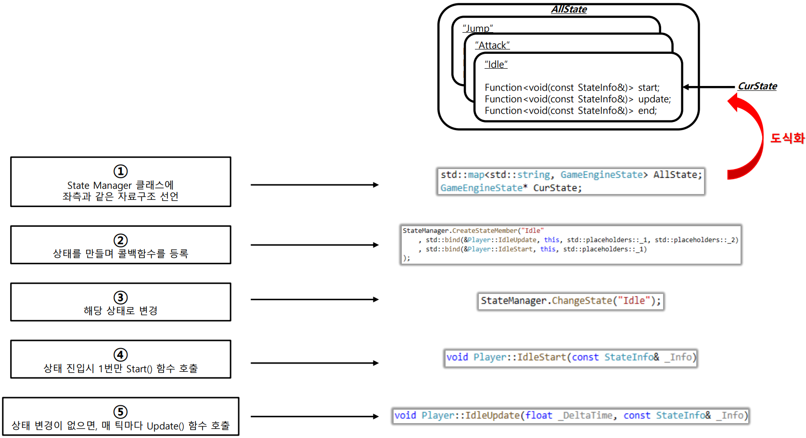
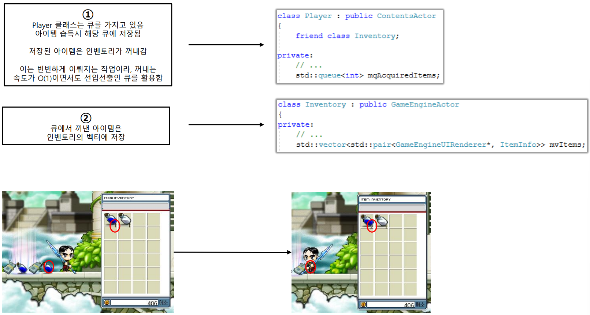
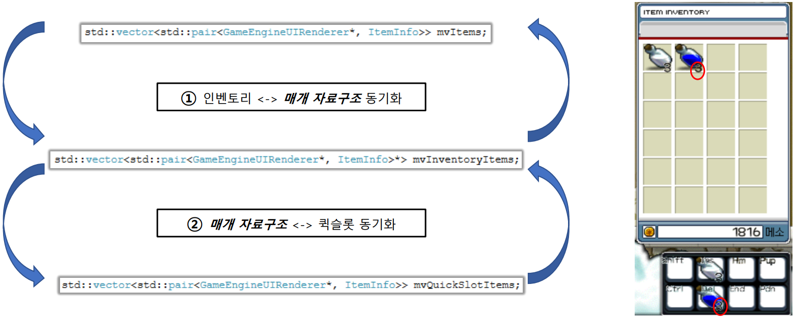
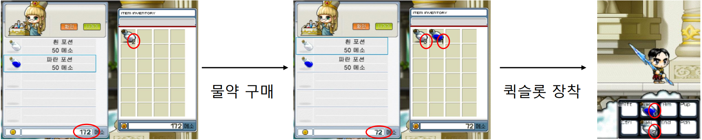

# PGH_MapleStory

   

## 프로젝트 소개

C++, DirectX11, IMGUI를 활용하여 만든 "MapleStory" 모작 개인프로젝트입니다.

개발기간: 2022년 08월 한달간

  

## 주요 기능

  
Finite-State Machine을 활용한 애니메이션 구조 구현

   
  
{

   

      <figure>
         
         <figurecaption> 애니메이션 구조를 구현하기 위해서 FSM을 직접 구현해보았습니다.</figurecaption>
      </figure>
   
 
   
  
}

  

  

  
인벤토리

    
   
{

   

      <figure>
         
         <figurecaption> C++ STL 자료구조를 활용해보기 위해서 인벤토리를 구현했습니다.</figurecaption>
      </figure>
   
 
    
   
}

  

  

  
퀵슬롯과 상점

  
{

  

      <figure>
         
         <figurecaption> 아이템을 퀵슬롯에 드래그드랍으로 장착 후 사용시 인벤토리와 연동되게끔 했습니다.</figurecaption>
      </figure>
   
 
   

      <figure>
         
         <figurecaption> 간단한 상점 컨텐츠도 구현해보았습니다.</figurecaption>
      </figure>
   
 
    
   
  
}

  

  

   
